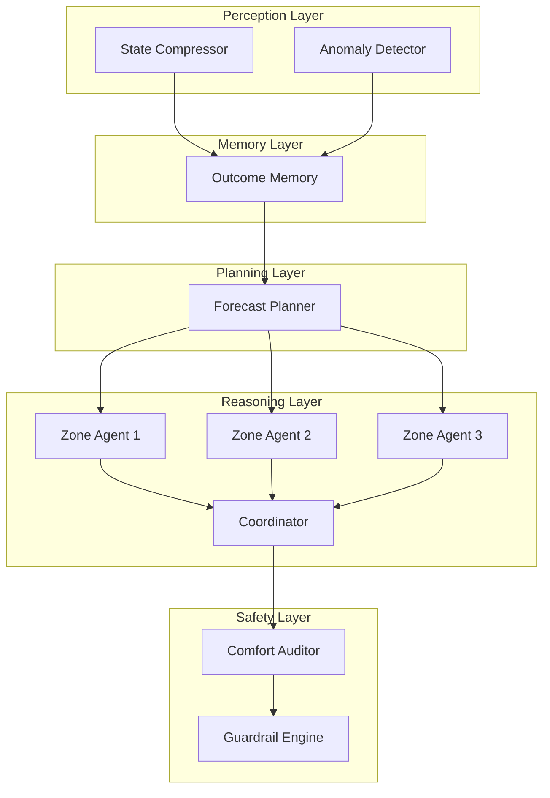

# Evolving Eco-Loop: The Leap from Monolithic Scripts to a 5-Layer Cognitive Architecture

Commercial HVAC systems are notoriously stubborn. They operate on rigid schedules, relying heavily on isolated PID loops that remain oblivious to the outside world. When we first set out to build Eco-Loop, our goal was simple. We wanted to inject artificial intelligence directly into building management systems. By allowing an LLM to read sensor data and write setpoints, we figured we could easily optimize energy consumption against grid carbon intensity and occupant comfort. 

However, reality quickly humbled our initial designs. This post explores how we crashed into the limitations of single-agent control, why we tore everything down, and exactly how we engineered the robust 5-layer cognitive architecture that powers Eco-Loop today.

## The Single-Agent Bottleneck

Our prototype relied on a single monolithic agent. Every thirty minutes, we dumped the entire building state into a massive prompt. This included telemetry from five thermal zones, twenty-four hour weather forecasts, grid carbon signals, and historical performance data. 

The agent was expected to digest this colossal wall of text, reason about thermal dynamics, and output precise heating and cooling setpoints for every single zone.

It failed spectacularly. 

Token limits choked the context window. Latency spiked to unusable levels. More alarmingly, the monolithic approach degraded the model's reasoning capabilities. When asked to balance a localized temperature drop in the perimeter zone against a facility-wide peak demand cap, the model would lose the plot. It hallucinated setpoints. It ignored physical constraints. We realized that forcing a single probabilistic model to act as a localized sensor, a long-term planner, and a strict safety gatekeeper simultaneously was an architectural dead end.

We needed decentralization. We needed specialized intelligence.

## Designing the 5-Layer Cognitive Stack

Taking inspiration from human cognition and microservice architectures, we dismantled the monolith. We distributed the workload across seven distinct LLM agents, organizing them into a strict, hierarchical execution pipeline. 

This multi-layer approach ensures that high-level strategy never interferes with low-level zone control, and probabilistic reasoning is always caught by deterministic safety nets.

### Layer 1: Perception

Raw telemetry from building sensors is noisy and overwhelming. Before any decision making occurs, the Perception layer sanitizes the data. 

The **State Compressor** agent distills thousands of data points into a concise, token-efficient state summary. Concurrently, the **Anomaly Detector** scans the raw feed for faulty sensor readings or sudden equipment failures. By filtering out the noise early, we drastically reduce token consumption for downstream agents and ensure the reasoning engine only operates on high-confidence data.

### Layer 2: Memory

A smart building must learn from its mistakes without requiring constant model retraining. The Memory layer acts as a specialized vector store that retrieves the outcomes of similar past conditions. If a specific cooling strategy previously resulted in an unacceptable comfort violation on a humid afternoon, the Memory layer injects that historical context directly into the current execution cycle. This grants the system a form of synthetic intuition.

### Layer 3: Planning

We decoupled long-term strategy from immediate tactical control. The **Forecast Planner** does not run every cycle. Instead, it wakes up every six hours to analyze macro variables. It ingests 24-hour weather projections and real-time grid carbon intensity signals. 

Its sole job is to establish a global facility strategy and set a strict peak demand cap. By isolating this task, the Planner can utilize a larger, more capable model to generate complex strategies without slowing down the rapid 30-minute control loops.

### Layer 4: Reasoning (The Negotiation Protocol)

This is where the magic happens. Instead of one brain managing the entire building, we deployed an independent agent for every thermal zone. 

Operating in parallel via `asyncio.gather`, these **Zone Agents** care only about their specific environment. They evaluate local temperatures against occupant comfort metrics and propose localized heating and cooling setpoints. Because their scope is microscopically focused, their reasoning is incredibly sharp.

However, five independent agents maximizing their own comfort could easily spike the building's energy usage past the grid limit. To solve this, proposals are routed to the **Coordinator**. The Coordinator reviews all zone requests against the global peak demand cap established by the Planning layer. If the combined requests exceed the limit, the Coordinator acts as a strict arbiter. It forces zones to negotiate, dialing back non-critical cooling requests in empty areas to subsidize crucial heating in occupied spaces.

### Layer 5: Safety

We cannot trust generative AI with raw control over heavy machinery. Probabilistic models hallucinate. They make mistakes. 

The final stage of the pipeline is entirely deterministic. The **Comfort Auditor** ensures no proposed setpoint violates established safety bands. Finally, the **Guardrail Engine** acts as the ultimate physical safety check. If a software glitch or an aggressive Coordinator decision attempts to push an actuator beyond its mechanical limits, the Guardrail Engine clamps the value. This hardcoded, non-LLM layer guarantees that physical hardware remains protected regardless of what the neural networks decide.

## The Result

Moving from a single script to a 5-layer cognitive architecture completely transformed Eco-Loop. 

By compartmentalizing perception, planning, and reasoning, we achieved a system that is both incredibly responsive to local microclimates and strictly obedient to global energy constraints. Token usage plummeted. Decision latency dropped by an order of magnitude. Most importantly, the system stopped fighting itself. The building now negotiates its own energy footprint smoothly, intelligently, and safely.
