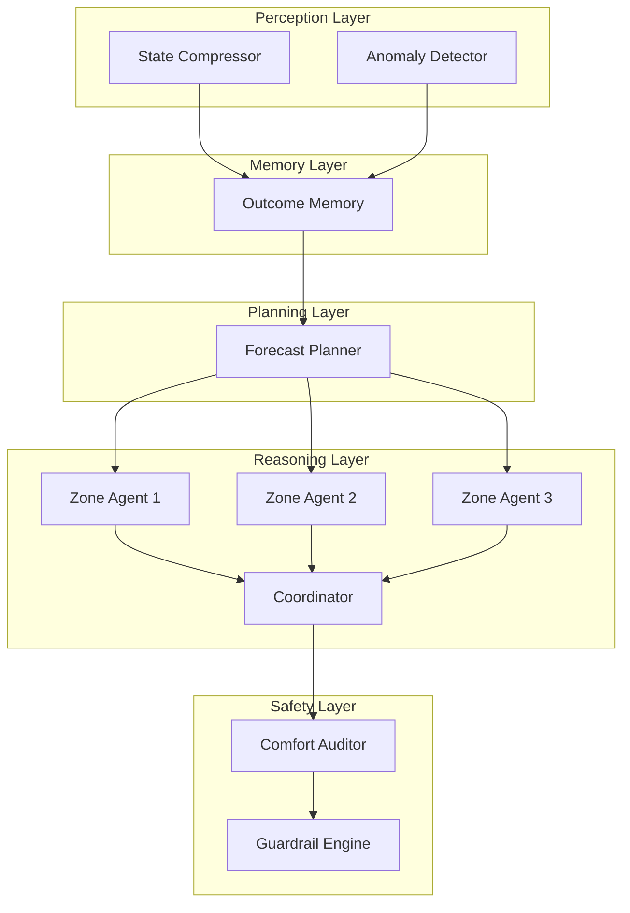

# Eco-Loop: Architecting Cognitive Building Intelligence

Commercial HVAC systems are notoriously stubborn. They operate on rigid schedules, relying heavily on isolated PID loops that remain entirely oblivious to the outside world. This isolated approach is the root cause of massive inefficiencies in modern infrastructure.

When a facility relies on independent controllers for every single thermal zone, those zones inevitably fight each other. One perimeter zone might trigger aggressive heating to counteract a morning chill, while an interior core zone simultaneously blasts chilled air to manage occupancy heat. Neither controller knows what the other is doing. Furthermore, neither controller possesses any awareness of macro variables like upcoming weather fronts, real-time grid carbon intensity, or facility-wide peak demand caps. Without shared context, buildings waste up to thirty percent of their total energy consumption simply fighting themselves.

Our objective with Eco-Loop was to solve this fundamental lack of coordination. We needed to build a system where localized zone demands could be intelligently arbitrated against global facility constraints in real time. 

## The Solution: Local Proposals, Central Arbitration

To eradicate the inefficiencies of isolated PID loops, we envisioned a system where buildings negotiate their own energy use. 

Instead of relying on a centralized script to dictate temperatures, Eco-Loop deploys a lightweight, independent artificial intelligence agent to every single thermal zone. These local agents watch incoming telemetry, evaluate occupant comfort metrics, and propose specific heating and cooling setpoints. 

However, they do not have direct control over the hardware. Instead, they route their proposals over the Model Context Protocol to a central Coordinator. The Coordinator acts as a strict arbiter. It evaluates all competing zone requests against a global energy cap established by a high-level planning agent. If the combined requests exceed the grid limit, the Coordinator forces the system to compromise. It intelligently scales back non-critical cooling in unoccupied areas to subsidize necessary heating elsewhere.

This negotiation protocol elegantly bridges the gap between micro-level comfort and macro-level energy efficiency.

## Engineering the Cognitive Architecture

Initially, we attempted to achieve this using a single monolithic LLM. We dumped the entire building state into one massive prompt. This approach failed spectacularly. The model hallucinated setpoints, ignored physical constraints, and buckled under massive latency. A single probabilistic model simply cannot act as a localized sensor, a long-term planner, and a strict safety gatekeeper all at once.

To execute our negotiation solution reliably, we dismantled the monolith. We distributed the workload across seven distinct LLM agents, organizing them into a strict 5-layer execution pipeline. This hierarchy ensures that high-level strategy never interferes with low-level zone control, and probabilistic reasoning is always caught by deterministic safety nets.

### Layer 1: Perception

Raw telemetry from building sensors is noisy and overwhelming. Before any decision making occurs, the Perception layer sanitizes the data. The **State Compressor** distills thousands of data points into a concise, token-efficient state summary. Concurrently, the **Anomaly Detector** scans the raw feed for faulty sensor readings or sudden equipment failures. By filtering out noise early, we drastically reduce token consumption for downstream agents and ensure the reasoning engine only operates on high-confidence data.

### Layer 2: Memory

A smart building must learn from its mistakes without requiring constant model retraining. The Memory layer acts as a specialized vector store that retrieves the outcomes of similar past conditions. If a specific cooling strategy previously resulted in an unacceptable comfort violation on a humid afternoon, the Memory layer injects that historical context directly into the current execution cycle. This grants the system a form of synthetic intuition.

### Layer 3: Planning

To solve the lack of macro-awareness in traditional HVAC, we decoupled long-term strategy from immediate tactical control. The **Forecast Planner** does not run every cycle. Instead, it wakes up every six hours to analyze 24-hour weather projections and real-time grid carbon intensity signals. 

Its sole job is to establish a global facility strategy and set a strict peak demand cap. By isolating this task, the Planner can utilize a larger, more capable model to generate complex strategies without slowing down the rapid 30-minute control loops.

### Layer 4: Reasoning

This layer executes the core negotiation protocol. Operating in parallel via asynchronous batches, the **Zone Agents** evaluate their specific environments and propose setpoints. Because their scope is microscopically focused, their reasoning is incredibly sharp.

These proposals are routed to the **Coordinator**. The Coordinator reviews all requests against the peak demand cap established by the Planning layer. If the combined requests exceed the limit, the Coordinator forces a negotiation, actively dialing back specific zones to maintain compliance with the global strategy. 

### Layer 5: Safety

We cannot trust generative AI with raw control over heavy machinery. Probabilistic models make mistakes. 

The final stage of the pipeline is entirely deterministic. The **Comfort Auditor** ensures no proposed setpoint violates established occupant safety bands. Finally, the **Guardrail Engine** acts as the ultimate physical safety check. If a software glitch or an aggressive Coordinator decision attempts to push an actuator beyond its mechanical limits, the Guardrail Engine clamps the value. This hardcoded, non-LLM layer guarantees that physical hardware remains protected regardless of what the neural networks decide.

## Conclusion

By structuring our solution across five distinct cognitive layers, Eco-Loop transforms a building from a collection of isolated, fighting machines into a cohesive, negotiating intelligence. The system successfully bridges the gap between localized occupant comfort and macro-level grid efficiency, proving that autonomous agents can reliably manage critical physical infrastructure.
