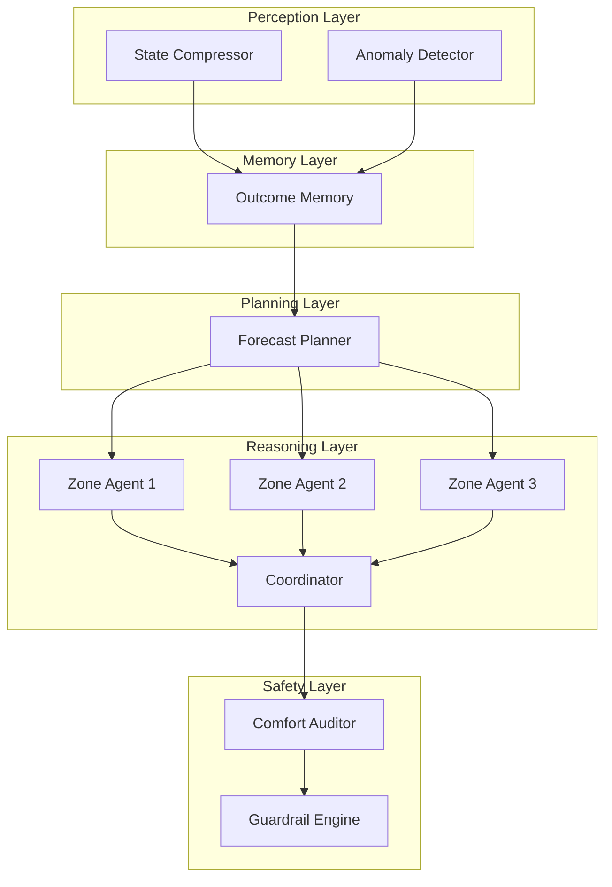

# Eco-Loop: Solving the 40% Global Energy Problem with Cognitive Buildings

Buildings consume approximately 40% of global energy and remain a primary driver of carbon emissions. Despite this massive footprint, the vast majority of commercial structures are surprisingly unintelligent. 

Traditional Building Management Systems (BMS) rely on rigid, rule-based schedules and isolated PID loops. They are programmed to follow static instructions regardless of context. When an unexpected heatwave rolls in, when occupancy suddenly drops, or when the local power grid faces a critical demand spike, these traditional systems fail to adapt dynamically. They blindly execute their programmed schedules, resulting in massive energy waste and compromised occupant comfort.

**If** our buildings remain passive, schedule-bound energy consumers incapable of reacting to real-world variables, **then** we will never hit our aggressive climate targets without sacrificing human comfort. 

## The Solution: A Paradigm Shift to Autonomous Structures

We decided to solve this by transforming the building from a passive consumer into an active, self-correcting agent capable of continuous, real-time optimization.

Our objective was to build a live, operational Physical AI Proof-of-Concept. We set out to create an autonomous closed-loop control pipeline driven entirely by open-source Large Language Models (LLMs) communicating via the Model Context Protocol (MCP). Instead of humans hardcoding daily schedules, an AI brain would ingest continuous performance metrics, evaluate complex variables, and dynamically update set-points.

To safely develop and validate this cognitive engine, we needed a way to simulate high-fidelity physical data. Therefore, we integrated **EnergyPlus** as our digital building sandbox. While not part of the core AI problem statement, EnergyPlus served as our crucial testing ground. It streams continuous feedback (zone temperatures, air quality, energy consumption, and Predicted Mean Vote comfort indices) into our AI, and allows us to verify the forward injection of our dynamic control actions.

## Architecting the Closed-Loop Execution Framework

To reliably bridge open-source LLMs with physical infrastructure, we couldn't rely on a single, monolithic script. A single prompt digesting all building data quickly suffers from context bloat and hallucination. 

Instead, we engineered a distributed, 5-layer cognitive architecture. This ensures our closed-loop pipeline executes robustly without crashing over extended time horizons.

### 1. Feedback (EnergyPlus to AI)
The closed loop begins with our **Perception Layer**. The system ingests the raw stream of EnergyPlus simulation data. Because raw telemetry is noisy, our *State Compressor* distills thousands of data points into a concise state summary, while the *Anomaly Detector* flags potential sensor faults. This ensures the reasoning engine only evaluates high-confidence data, drastically reducing prompt latency.

### 2. Planning and Macro-Awareness
Before executing local control actions, the system establishes a global strategy. The **Planning Layer** ingests 24-hour weather projections and real-time local carbon grid intensity. It calculates a peak demand threshold for the entire facility. This solves the fundamental flaw of traditional BMS by providing macro-awareness before micro-adjustments are made.

### 3. Reasoning and Control Actions
This is where the LLM evaluates the building's state against our predefined targets: occupancy comfort and energy reduction. We deployed an independent **Zone Agent** for every thermal zone. These agents read local conditions and propose localized Energy Conservation Measures (ECMs) and set-points.

However, to prevent zones from fighting each other and breaching the facility's demand cap, proposals are routed to a **Coordinator**. The Coordinator actively negotiates competing requests. It intelligently balances human comfort against energy efficiency, perhaps slightly relaxing the cooling in a vacant hallway to subsidize necessary heating in a crowded boardroom.

### 4. Forward Injection (AI to EnergyPlus)
Before computed set-points are injected back into the active EnergyPlus instance, they pass through a strictly deterministic **Safety Layer**. The *Comfort Auditor* verifies that no LLM decision violates the established PMV thermal comfort boundaries. Finally, a hardcoded *Guardrail Engine* clamps any runaway set-point proposals, ensuring the physical AI safely interacts with hardware limits.

## Conclusion

By pairing physics-based energy simulation with a highly orchestrated, multi-agent LLM framework, Eco-Loop achieves a true paradigm shift. It proves that by replacing rigid schedules with closed-loop cognitive reasoning, we can drastically reduce net energy consumption while maintaining strict thermal comfort constraints.
